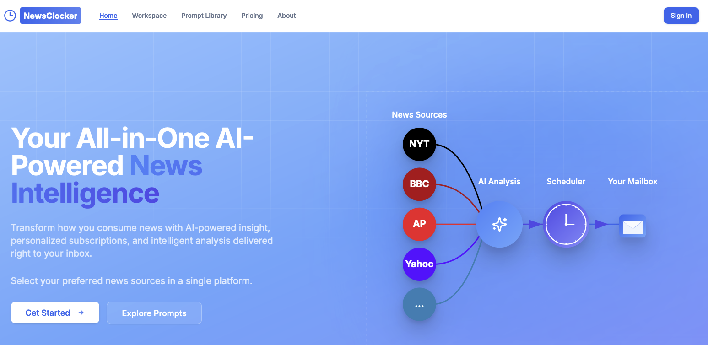

# NewsClocker - AI-Powered News Intelligence Platform


NewsClocker is an open-source intelligent news platform that transforms how professionals consume and analyze news through AI-powered insights and personalized delivery.



## Project Components

NewsClocker consists of three main components:

1. **Frontend (This Repository)**

   - Next.js web application
   - User interface and client-side functionality
   - Authentication and payment integration

2. **Backend API** ([newsclocker-backend-apis](https://github.com/Nelsonlin0321/newsclocker-backend-apis))

   - FastAPI application
   - Handles news scraping and processing
   - Manages PDF generation
   - Provides API endpoints for news search and analysis

3. **Scheduler** ([newsclocker-scheduler](https://github.com/Nelsonlin0321/newsclocker-scheduler))
   - Infrastructure as Code using Terraform
   - Manages scheduled news delivery
   - Handles automated email distribution
   - AWS Lambda functions for serverless execution

## Features

- **Personalized News Subscriptions**

  - Custom keyword-based news search
  - Flexible news source selection
  - Customizable delivery schedules
  - Multi-language support

- **AI-Powered Insights**

  - Custom news analysis prompts
  - Community prompt sharing
  - PDF report generation
  - Intelligent news synthesis

- **Dedicated News Inbox**
  - Organized AI insights
  - PDF export capabilities
  - Star important insights
  - Archive management

## Tech Stack

### Frontend (This Repository)

- **Framework**: Next.js 14, React, TypeScript
- **Styling**: Tailwind CSS
- **Database**: MongoDB with Prisma ORM
- **Authentication**: Clerk
- **Payments**: Stripe
- **Email**: AWS SES

### Backend API

- **Framework**: FastAPI
- **News Processing**: Beautiful Soup, Newspaper3k
- **PDF Generation**: WeasyPrint
- **Deployment**: Docker

### Scheduler

- **Infrastructure**: Terraform
- **Cloud Provider**: AWS
- **Services Used**:
  - AWS Lambda
  - EventBridge
  - SQS
  - CloudWatch
  - IAM

**Medium Post** ([Link](https://medium.com/@nelsonlin0321/building-newsclocker-a-deep-dive-into-our-event-driven-custom-scheduler-infrastructure-part-1-c6dadde5a6bd))

**Architecture**


## Prerequisites

- Node.js 20+
- MongoDB database
- AWS account for SES
- Clerk account for authentication
- Stripe account for payments
- AI service credentials (Azure OpenAI/Google Vertex AI/DeepSeek)
- Python 3.9+ (for backend API)
- Terraform (for scheduler)

## Environment Variables

Create a `.env` file with the following variables:

\`\`\`env

# Database

DATABASE_URL="your_mongodb_url"

# Authentication

NEXT_PUBLIC_CLERK_PUBLISHABLE_KEY="your_clerk_publishable_key"
CLERK_SECRET_KEY="your_clerk_secret_key"

# AI Services

AZURE_OPENAI_API_KEY="your_azure_openai_key"
DEEPSEEK_API_KEY="your_deepseek_key"
VERTEX_AI_PRIVATE_KEY_ID="your_vertex_ai_key_id"
VERTEX_AI_PRIVATE_KEY_ENCODED="your_vertex_ai_private_key"

# AWS

AWS_ACCESS_KEY_ID="your_aws_access_key"
AWS_SECRET_ACCESS_KEY="your_aws_secret_key"
AWS_REGION="your_aws_region"

# Stripe

STRIPE_SECRET_KEY="your_stripe_secret_key"
STRIPE_WEBHOOK_SECRET="your_stripe_webhook_secret"
STRIPE_MONTHLY_PRICE_ID="your_monthly_price_id"
STRIPE_YEARLY_PRICE_ID="your_yearly_price_id"
NEXT_PUBLIC_STRIPE_CUSTOMER_PORTAL_URL="your_stripe_portal_url"

# API

API_KEY="your_api_key"
BACKEND_API_URL="your_backend_url"
\`\`\`

## Installation

### Frontend (This Repository)

1. Clone the repository:

   ```bash
   git clone https://github.com/Nelsonlin0321/newsclocker
   cd newsclocker
   ```

2. Install dependencies:

   ```bash
   npm install
   ```

3. Generate Prisma client:

   ```bash
   npx prisma generate
   ```

4. Push database schema:

   ```bash
   npx prisma db push
   ```

5. Start the development server:
   ```bash
   npm run dev
   ```

### Backend API

1. Clone the backend repository:

   ```bash
   git clone https://github.com/Nelsonlin0321/newsclocker-backend-apis.git
   cd newsclocker-backend-apis
   ```

2. Create and activate virtual environment:

   ```bash
   python -m venv venv
   source venv/bin/activate  # On Windows: venv\Scripts\activate
   ```

3. Install dependencies:

   ```bash
   pip install -r requirements.txt
   ```

4. Start the FastAPI server:
   ```bash
   uvicorn app.main:app --reload
   ```

### Scheduler

1. Clone the scheduler repository:

   ```bash
   git clone https://github.com/Nelsonlin0321/newsclocker-scheduler.git
   cd newsclocker-scheduler
   ```

2. Initialize Terraform:

   ```bash
   terraform init
   ```

3. Plan and apply infrastructure:
   ```bash
   terraform plan
   terraform apply
   ```

## Docker Deployment

### Frontend

```bash
docker build -t newsclocker-frontend .
docker run -p 3000:3000 --env-file .env newsclocker-frontend
```

### Backend API

```bash
docker build -t newsclocker-backend .
docker run -p 8000:8000 --env-file .env newsclocker-backend
```

## Contributing

We welcome contributions! Please follow these steps:

1. Fork the repository
2. Create a feature branch
3. Commit your changes
4. Push to the branch
5. Create a Pull Request

## License

This project is licensed under the MIT License - see the [LICENSE](LICENSE) file for details.

## Support

For support, please open an issue in the GitHub repository or contact us at contact@newsclocker.com.

## Acknowledgments

- Thanks to all contributors who have helped shape NewsClocker
- Special thanks to the open-source community for the amazing tools and libraries
